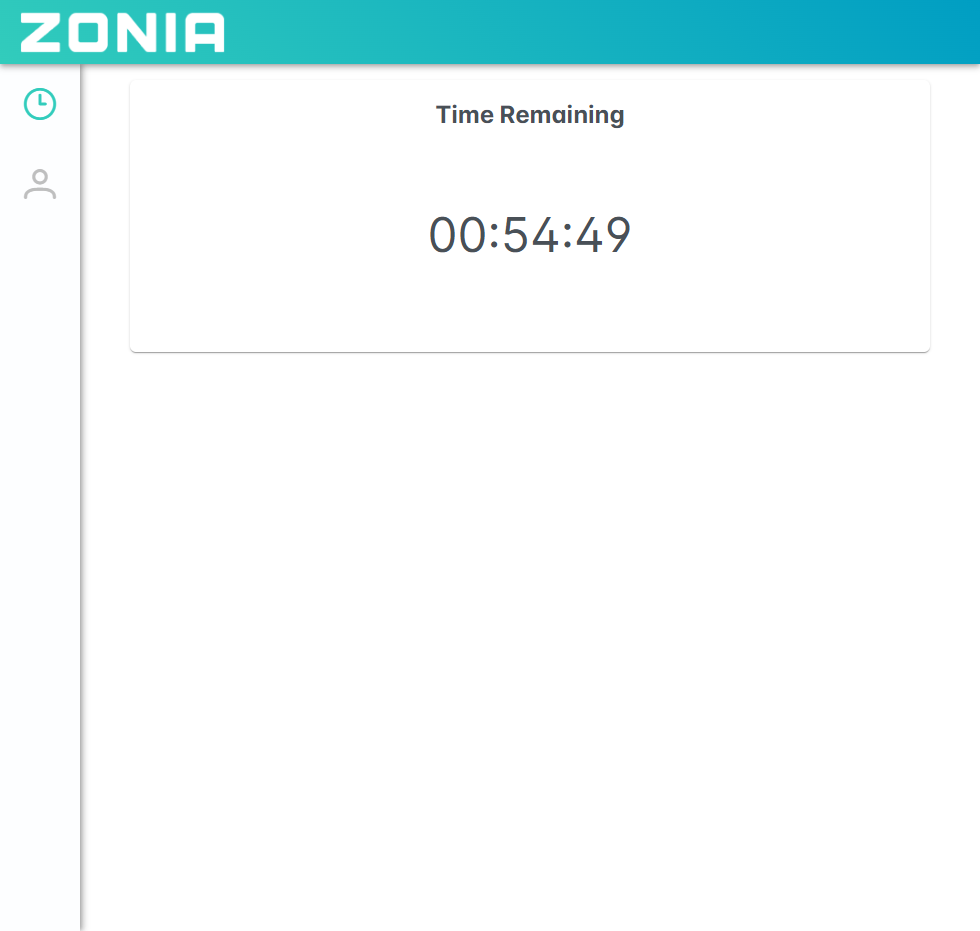
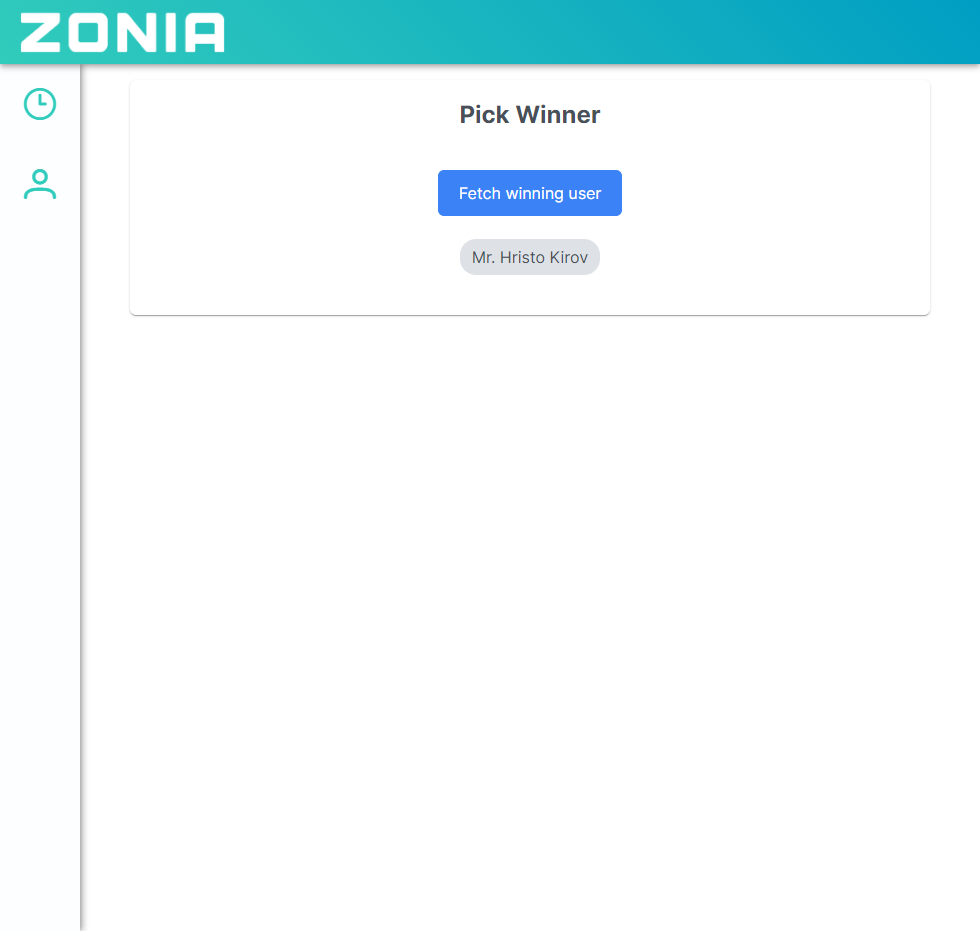

# Zonia interview task
## Preview:



## Requirements:
You can find the full requirements in the Task.pdf file.

## How to run:
* Clone the repository
* run npm install in raffle-backend and raffle-frontend folders
* (optional) run npm build for the **Angular** app in the raffle-frontend folder
* (optional) run the "transfer-angular-dist.bat" file to transfer the newly built dist folder to the raffle-backend public folder
* run npm start in the raffle-backend folder 

## How to use:
* Open the browser and navigate to http://localhost:3000 (this will load the Angular app)  - this will navigate to time-left page which will show remaining time 
  * If the time is up, the page will show a button to open the winning user page
* Open the winning button page and click on the button to get the randomly generated winner.

## How to reset:
* Restart the node server of make a POST request to http://localhost:3000/api/reset

## How to test:
* run the node server and check if the time-left page is showing the remaining time
* make a POST request to http://localhost:3000/api/dev/expire-time to expire the time
* check if the time-left page is showing the "Time expired" message and the button is showing

## Notes:

### Backend:
* The backend is a TypeScript node server that serves the Angular app and exposes a REST API.
* The REST API is used to get the remaining time and to get the winner.
* The REST API is also used to reset the app to the initial state.
* The REST API is also used to expire the time for testing purposes.
* The backend uses a simple in-memory database to store the users and the time.
* The time of expiration is generated once, when the server starts
* The winning user is generted on the first request after the time has expired and is persistent
* If the winning user requested before the time has expired, null will be returned and how much time is left

#### REST API:
http://localhost:3000/api

* GET /time - returns the remaining time in seconds
```
{
    "timeOfNextRaffle": "2023-11-10T01:12:35.790Z",
    "timeLeftUntilNextRaffleMs": 6556185
}
```
---

* GET /user - returns the winning user

```
{
    "user": null,
    "timeLeftUntilNextRaffleMs": 6495836
}
``` 
or 
```
{
    "user": {
        "firstName": "Petar",
        "lastName": "Dimitrov",
        "gender": 1
    }
}
```
---
* POST /reset - resets the app to the initial state (generates new expiration time and clears the winning user)
```
{
    "message": "Reset successful",
    "timeOfNextRaffle": "2023-11-10T00:15:23.898Z",
    "timeLeftUntilNextRaffleMs": 4416023
}
```

---
* POST /dev/expire-time - expires the time for testing purposes
```
{
    "message": "Time expired"
}
```


### Frontend:
* The app uses PrimeNG for the UI components
* The frontend is an Angular app that uses the REST API to get the remaining time and to get the winner.
* There are 2 routes for the 2 views - time-left and winning-user. All other routes redirect to time-left
  * winning-user has AuthGuard that checks if the time has expired and redirects to time-left if it has not
* There is a menu with 2 buttons - one for each view
  * The winning-user button is disabled if the time has not expired
* There are 2 main services - time.service.ts and user.service.ts
  * time.service provides data about when time will expire and if it has expired - it has both Observables to notify you when time has expired and boolean "flag" to check if the time has expired
  * user.service simply fetches the winning user from the backend
* Responses from the server are typed
* If time expired while the user is on the time-left page, the button in the menu will be activated and new button will be shown on the page to open the winning-user page


